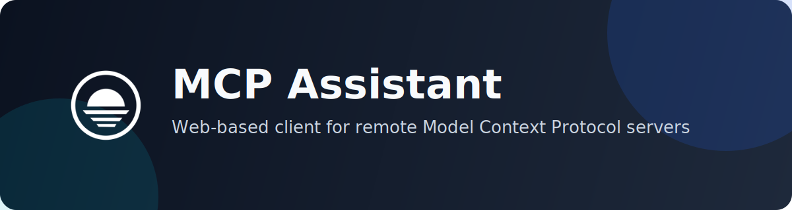
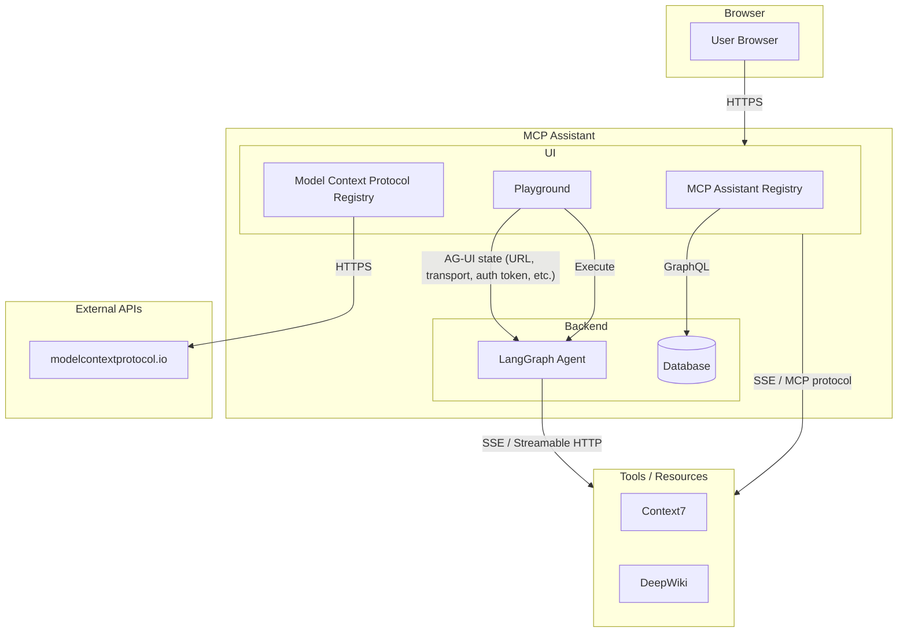

  

  
  

## 🌐 Overview

MCP Assistant helps developers discover, connect, and use Model Context Protocol (MCP) servers from a clean web interface.  
It is designed for teams that want fast setup, secure access, and better visibility while working with multiple MCP endpoints.

## ✨ Why MCP Assistant

- Connect to remote MCP servers through `SSE` and `Streamable HTTP`
- Manage multiple MCP servers from a single interface
- Handle OAuth 2.0 and OpenID Connect flows without manual token juggling
- Explore available tools and run them directly from the UI
- Monitor connections in real time while testing and debugging integrations
- Work from anywhere without local MCP server setup

## 🚀 Core Capabilities

### 🔌 Model Context Protocol
- Multi-transport connectivity for modern MCP deployments
- Dynamic server registration and lifecycle management
- Standards-aligned authentication support (`RFC 8414`, OIDC discovery)
- Unified tool discovery and execution workflows

### 🤖 Agent-User Interaction (AG-UI)
- Real-time streaming for responsive conversations
- Structured rendering of tool outputs
- Live execution logs and event updates
- Human-in-the-loop review and approval flows

## 🏗️ Architecture

## ⚡ Quick Start

### ➕ Add an MCP Server

1. Open the MCP Servers page.
2. Click `Add Server`.
3. Enter:
   - `Server Name`
   - `Transport Type` (`SSE` or `Streamable HTTP`)
   - `Server URL`
   - Optional OAuth2 configuration
4. Save to connect.

### 💬 Start Using the Assistant

1. Select one or more connected servers from the sidebar.
2. Choose your LLM provider.
3. Enter your API key.
4. Start chatting and execute tools from connected MCP servers.

## 🤝 Contributing

Contributions are welcome.  
Please open an issue for major changes or submit a pull request directly for improvements and fixes.
